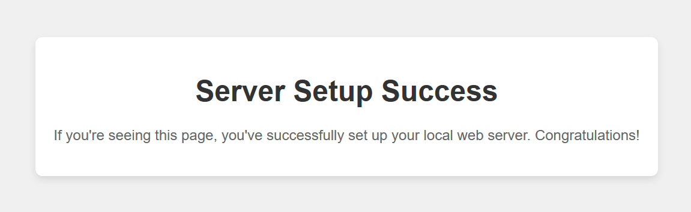

# Terminal Efficiency Tasks

Google Form: [Terminal Efficiency Tasks](https://forms.gle/4oUtTs7usD1rVa8L8)

## Latin Squares
| Participant | Device 1 (Tasks)          | Device 2 (Tasks)          | Device 3 (Tasks)          |
|-------------|---------------------------|---------------------------|---------------------------|
| 1           | Task-3, Task-6, Task-9    | Task-1, Task-5, Task-8    | Task-2, Task-4, Task-7    |
| 2           | Task-2, Task-5, Task-7    | Task-1, Task-6, Task-9    | Task-3, Task-4, Task-8    |
| 3           | Task-1, Task-6, Task-9    | Task-3, Task-4, Task-8    | Task-2, Task-5, Task-7    |
| 4           | Task-3, Task-5, Task-7    | Task-2, Task-4, Task-8    | Task-1, Task-6, Task-9    |
| 5           | Task-2, Task-4, Task-8    | Task-3, Task-5, Task-7    | Task-1, Task-6, Task-9    |
| 6           | Task-3, Task-6, Task-8    | Task-1, Task-5, Task-7    | Task-2, Task-4, Task-9    |
| 7           | Task-2, Task-5, Task-9    | Task-1, Task-6, Task-8    | Task-3, Task-4, Task-7    |
| 8           | Task-1, Task-5, Task-8    | Task-2, Task-4, Task-7    | Task-3, Task-6, Task-9    |
| 9           | Task-3, Task-4, Task-7    | Task-1, Task-5, Task-8    | Task-2, Task-6, Task-9    |
| 10          | Task-3, Task-5, Task-9    | Task-1, Task-4, Task-8    | Task-2, Task-6, Task-7    |
| 11          | Task-1, Task-6, Task-8    | Task-3, Task-5, Task-9    | Task-2, Task-4, Task-7    |
| 12          | Task-3, Task-6, Task-9    | Task-1, Task-4, Task-7    | Task-2, Task-5, Task-8    |

## Easy Level Tasks

### Task 1: Create and Rename Files
- **Objective:** Execute basic file operations.
- **Instructions:**
  1. Go to `~/CS889/User-{}/Task-1`.
  2. Create a text file named `project_notes.txt`.
  3. Rename the file to `project_overview.txt`.
- **Verify Results:** 
```
peter@PeterPan:~/CS889/User-0/Task-1$ ls
project_overview.txt
```

### Task 2: Search for Text within Files
- **Objective:** Search within files for specific text.
- **Instructions:**
  1. Go to `~/CS889/User-{}/Task-2`.
  2. Display all lines containing the word "ERROR" in the file `~/CS889/User-{}/Task-2/server_logs.txt`, .
- **Verify Results:** 
Something like:
```
ERROR at 5:01 - An error occurred in module UI with code 795
ERROR at 10:59 - An error occurred in module DB with code 213
ERROR at 17:07 - An error occurred in module DB with code 651
ERROR at 18:18 - An error occurred in module Net with code 176
ERROR at 19:33 - An error occurred in module DB with code 110
ERROR at 21:33 - An error occurred in module DB with code 790
```

### Task 3: List Files with Specific Extensions
- **Objective:** Filter and count files of a specific type.
- **Instructions:**
  1. Go to `~/CS889/User-{}/Task-3`.
  2. List all `.py` files in the current directory.
  3. Count the number of `.py` files listed.
- **Verify Results:** 
You will get:
```
2191
```

## Medium Level Tasks

### Task 4: Batch Rename and Move Files
- **Objective:** Automate file management with batch processing.
- **Instructions:**
  1. Go to `~/CS889/User-{}/Task-4`.
  2. Rename all `.txt` files in `~/CS889/User-{}/Task-4` to `.md`.
  3. Move them to a newly created directory within `~/CS889/User-{}/Task-4` named `markdown_files`.
- **Verify Results:** 
```
peter@PeterPan:~/CS889/User-0/Task-4$ ls markdown_files
agatha.md  agatha_complete.md  sample_log_file.md  sherlock.md
```

### Task 5: Extract and Process Data from a CSV File
- **Objective:** Manipulate and process data files.
- **Instructions:**
  1. Go to `~/CS889/User-{}/Task-5`.
  2. Extract all email addresses from `~/CS889/User-{}/Task-5/contacts.csv`.
  3. Save these email addresses in `~/CS889/User-{}/Task-5/emails.txt`.
- **Verify Results:** 
Something like:
```
peter@PeterPan:~/CS889/User-0/Task-5$ cat emails.txt
john.doe63@sample.net
jane.smith96@website.com
alex.johnson50@demo.org
emily.davis3@sample.net
michael.brown83@website.com
john.doe71@example.com
jane.smith27@example.com
alex.johnson64@site.org
emily.davis35@site.org
......
```

### Task 6: Find and Kill a Running Process
- **Objective:** Manage system processes.
- **Instructions:**
  1. Identify the process running `backup_script.sh`.
  2. Terminate this process.
- **Verify Results:** 
The process should be terminated.

## Hard Level Tasks

### Task 7: Create a Simple Backup Script
- **Objective:** Write scripts for automation tasks.
- **Instructions:**
  1. Go to `~/CS889/User-{}/Task-7`.
  2. Write a bash script named `backup.sh` in `~/CS889/User-{}/Task-7`.
  3. The script should zip the directory `~/CS889/User-{}/project_data` and save it with the current date as the filename.
- **Verify Results:** 
Something like:
```
peter@PeterPan:~/CS889/User-0/Task-7$ ls -lh
total 264K
-rw-r--r-- 1 peter peter 255K Mar 28 14:57 2024-03-28_project_data.zip
-rwxr-xr-x 1 peter peter  413 Mar 28 14:57 backup.sh
drwxr-xr-x 4 peter peter 4.0K Mar 28 14:32 project_data
```

### Task 8: Set Up a Local Web Server and Serve a Specific File
- **Objective:** Set up and verify a simple web server.
- **Instructions:**
  1. Go to `~/CS889/User-{}/Task-8`.
  2. Serve files from `~/CS889/User-{}/Task-8/website_files` on port 8000 using Python's HTTP server module.
  3. Verify that `index.html` can be accessed through the browser.
- **Verify Results:** 
Go to `http://localhost:8000` in the browser.

### Task 9: Analyze and Filter Log Files
- **Objective:** Perform complex log analysis.
- **Instructions:**
  1. Analyze `~/CS889/User-{}/Task-9/access_logs.txt`.
  2. Extract requests made from IP address `10.0.0.1`.
  3. Count how many times a particular resource was requested.
- **Verify Results:** 
Something like:
```
peter@PeterPan:~/CS889/User-0/Task-9$ cat filtered_logs.txt
10.0.0.2 - - [02/Mar/2024:03:24:35 +0000] "GET /products.html HTTP/1.1" 301 4172
10.0.0.2 - - [28/Feb/2024:20:33:10 +0000] "GET /products.html HTTP/1.1" 404 3963
10.0.0.2 - - [01/Mar/2024:00:20:36 +0000] "GET /login.html HTTP/1.1" 301 4932
10.0.0.2 - - [21/Mar/2024:10:12:30 +0000] "GET /login.html HTTP/1.1" 301 3352
10.0.0.2 - - [29/Feb/2024:00:58:55 +0000] "GET /index.html HTTP/1.1" 500 2464
10.0.0.2 - - [12/Mar/2024:07:22:52 +0000] "GET /services.html HTTP/1.1" 301 2763
10.0.0.2 - - [25/Mar/2024:08:27:38 +0000] "GET /login.html HTTP/1.1" 404 2672
......
```